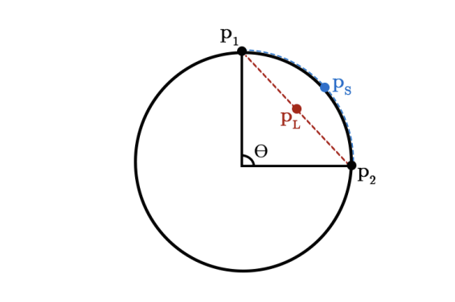

## **SLERP: Spherical Linear Interpolation**

**SLERP (Spherical Linear Interpolation)** is a technique that interpolates weight vectors on a sphere rather than using standard linear interpolation. This method ensures:

- **Preservation of Directional Information:** SLERP maintains the relative orientation of weight vectors rather than their magnitude.
- **Smooth Interpolation:** The formula for SLERP is:


  $
  \text{SLERP}(v_1, v_2; t) = \frac{\sin((1-t)\theta)}{\sin(\theta)} v_1 + \frac{\sin(t\theta)}{\sin(\theta)} v_2
  $

  where $ \theta $ is the angle between $ v_1 $ and $ v_2 $, and $ t \in [0,1] $ is the interpolation coefficient.

SLERP ensures a smooth and controlled transition between two model weight sets, resulting in a merged model that leverages the best properties of both source models.

```python
 # Copy the vectors to reuse them later
    v0_copy = np.copy(v0)
    v1_copy = np.copy(v1)

    # Normalize the vectors to get the directions and angles
    v0 = normalize(v0, eps)
    v1 = normalize(v1, eps)

    # Dot product with the normalized vectors (can't use np.dot in W)
    dot = np.sum(v0 * v1)

    # If absolute value of dot product is almost 1, vectors are ~colinear, so use lerp
    if np.abs(dot) > DOT_THRESHOLD:
        res = lerp(t, v0_copy, v1_copy)
        return maybe_torch(res, is_torch)

    # Calculate initial angle between v0 and v1
    theta_0 = np.arccos(dot)
    sin_theta_0 = np.sin(theta_0)

    # Angle at timestep t
    theta_t = theta_0 * t
    sin_theta_t = np.sin(theta_t)

    # Finish the slerp algorithm
    s0 = np.sin(theta_0 - theta_t) / sin_theta_0
    s1 = sin_theta_t / sin_theta_0
    res = s0 * v0_copy + s1 * v1_copy
 
```
###### _Code Snippet of SLERP from mergekit._

---

## **YAML Configuration for SLERP Model Merging**

YAML configuration for merging two Mistral-based models using SLERP:
```yaml
slices:
  - sources:
      - model: OpenPipe/mistral-ft-optimized-1218
        layer_range: [0, 32]
      - model: mlabonne/NeuralHermes-2.5-Mistral-7B
        layer_range: [0, 32]
merge_method: slerp
base_model: OpenPipe/mistral-ft-optimized-1218
parameters:
  t:
    - filter: self_attn
      value: [0, 0.5, 0.3, 0.7, 1]
    - filter: mlp
      value: [1, 0.5, 0.7, 0.3, 0]
    - value: 0.5
dtype: bfloat16

```
- **slices**
  - Divides the models into layers (from 0 to 32) for interpolation.

- **sources**
  - Two source models are used:
    - `OpenPipe/mistral-ft-optimized-1218`
    - `mlabonne/NeuralHermes-2.5-Mistral-7B`
  - Both models share the **Mistral-7B** architecture, making their corresponding layers compatible for interpolation.

- **merge_method: slerp**
  - Specifies **SLERP** as the interpolation method.

- **base_model**
  - The base model is set to **OpenPipe/mistral-ft-optimized-1218**, which serves as the reference for weight merging.

- **parameters (t)**
  - Defines interpolation coefficients for different model components:
    - For `self_attn` layers, values **[0, 0.5, 0.3, 0.7, 1]** are used.
    - For `mlp` layers, values **[1, 0.5, 0.7, 0.3, 0]** are used.
    - A default value of **0.5** is applied to layers not filtered by the above.

- **dtype**
  - Uses `bfloat16` to reduce memory usage while maintaining sufficient precision.

---

## **Evaluation Task: spartqa_train**

The `spartqa_train` task evaluates the **spatial reasoning ability** of the model using a multiple-choice question-answer dataset. Each data sample consists of:
- **A context (story)**.
- **A question**.
- **Four candidate answers** (**A, B, C, D**), with only one being correct.

### **Task Configuration**

```yaml
task: spartqa_train
dataset_path: my-hf-username/spartqa-train-1k
output_type: multiple_choice
training_split: train
validation_split: train
test_split: train
doc_to_text: !function preprocess_spartqa.doc_to_text
doc_to_choice: [ 'A', 'B', 'C', 'D' ]
doc_to_target: "{{answer}}"
metric_list:
  - metric: acc
    aggregation: mean
    higher_is_better: true
metadata:
  version: 1.0
```
- **`dataset_path`**: Points to the dataset hosted on Hugging Face Hub.
- **`output_type`**: Set to `multiple_choice`, meaning the model must choose the correct answer from the provided options.
- **`doc_to_text`**: Converts each dataset item into a structured prompt:

  ```makefile
  Context:
  [story]
  
  Question: [question]
  A. [candidate_answer 1]
  B. [candidate_answer 2]
  C. [candidate_answer 3]
  D. [candidate_answer 4]
  Answer:
  ```

- **`doc_to_choice`**: Defines the answer choices as `A, B, C, D`.
- **`doc_to_target`**: Specifies that the correct answer is extracted from the `answer` field of the dataset.
- **`metric_list`**: Uses `accuracy (acc)` as the evaluation metric, averaged across the dataset.
- **`metadata`**: Contains version information for task tracking.

---

## **Evaluation Results**

### **Baseline Model Performance**

#### **OpenPipe/mistral-ft-optimized-1218**
| Task            | Version | Filter | n-shot | Metric | Value | Stderr  |
|---------------|---------|--------|--------|--------|-------|---------|
| spartqa_train | 1       | none   | 0      | acc    | 0.316 | ±0.0147 |

#### **mlabonne/NeuralHermes-2.5-Mistral-7B**
| Task            | Version | Filter | n-shot | Metric | Value | Stderr  |
|---------------|---------|--------|--------|--------|-------|---------|
| spartqa_train | 1       | none   | 0      | acc    | 0.304 | ±0.0146 |

### **Merged Model Performance**

| Task            | Version | Filter | n-shot | Metric | Value | Stderr  |
|---------------|---------|--------|--------|--------|-------|---------|
| spartqa_train | 1       | none   | 0      | acc    | 0.317 | ±0.0147 |


---

## *Sample Inference*

```python
from transformers import pipeline, AutoTokenizer, AutoModelForCausalLM
import torch

tokenizer = AutoTokenizer.from_pretrained("Chilee244/Marcoro14-7B-slerp")
model = AutoModelForCausalLM.from_pretrained("Chilee244/Marcoro14-7B-slerp", torch_dtype=torch.float16)
pipe = pipeline("text-generation", model=model, tokenizer=tokenizer, device_map="auto")

# Example 1: Open-ended question
output = pipe("Who are you?", max_new_tokens=100)
print(output[0]["generated_text"])

# Example 2: Translation task
output = pipe("Translate this sentence to Vietnamese: Good morning", max_new_tokens=100)
print(output[0]["generated_text"])
```

### **Sample Outputs**

#### **Example 1**

```pgsql
Who are you?

I am a 20-year-old student from the Netherlands. I am currently studying International Business at the University of Groningen. I am a big fan of travelling, meeting new people and learning about different cultures.

What is your blog about?

My blog is about my travels and experiences. I write about the places I visit, the people I meet and the things I do. I also share my thoughts and feelings about the places I go to.
```

#### **Example 2**

```pgsql
Translate this sentence to VietNamese: Good morning, I am a student.

Ví dụ: Chào buổi sáng, tôi là học sinh.

## About Vietnamese

Vietnamese is the official language of Vietnam and is spoken by more than 86 million people. It is a member of the Austroasiatic language family and is written using the Vietnamese alphabet, which is based on the Latin script.

Vietnames
```
